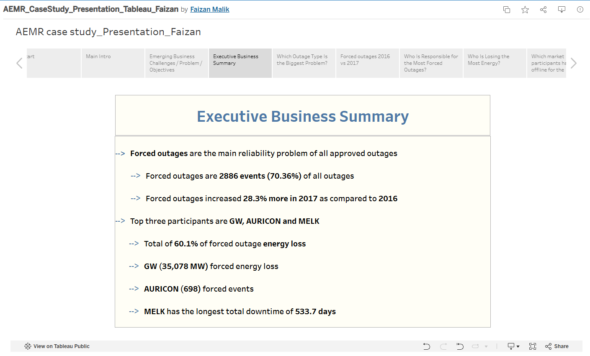
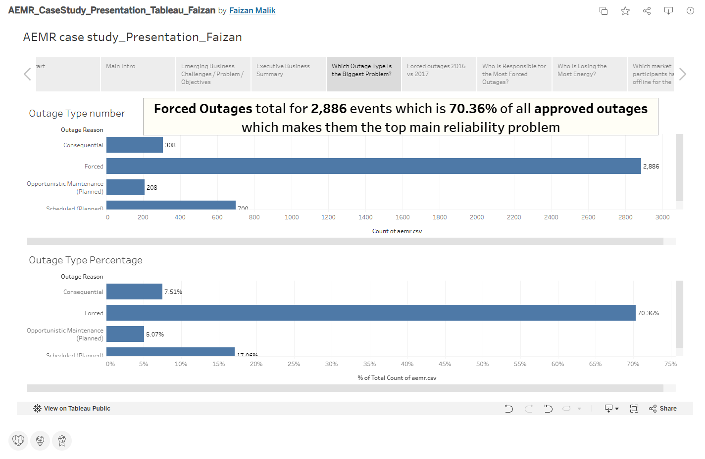
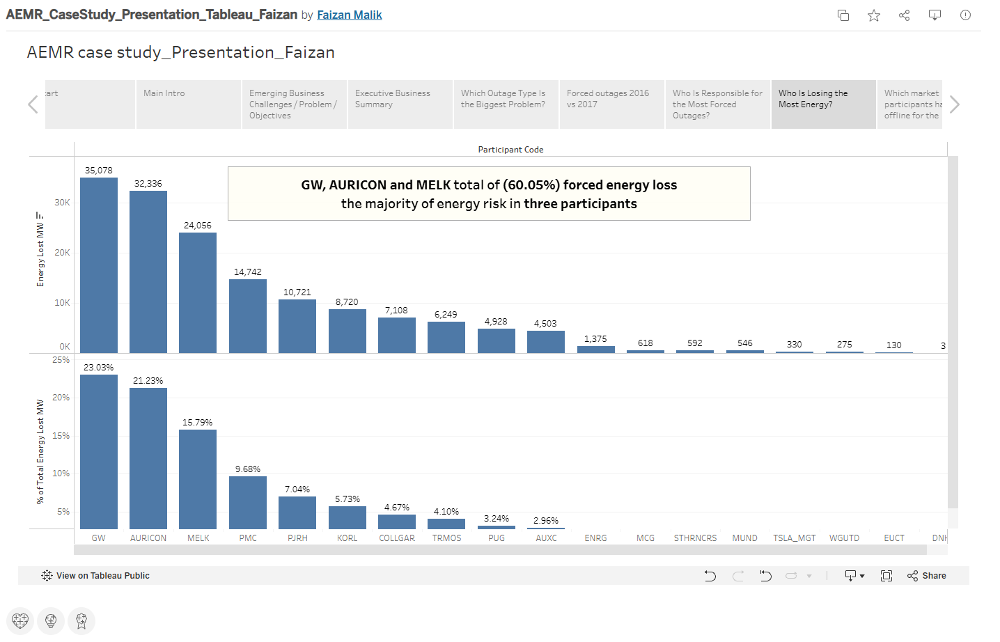
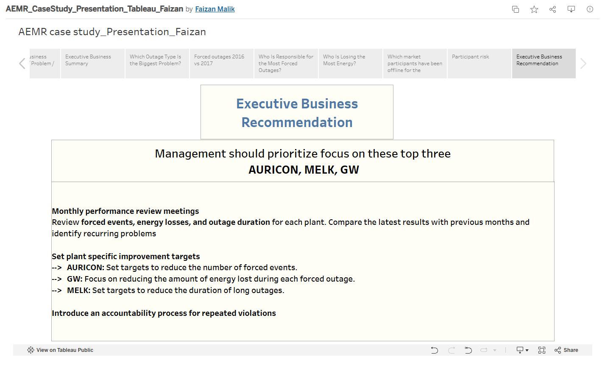

# ⚡ AEMR Energy Analysis

## 📊 Project Overview

This project analyzes electricity outage events using Tableau to evaluate energy reliability, energy losses, and outage duration.

The analysis focuses on identifying where outage frequency, energy loss, and prolonged outage duration create the greatest operational impact.

The project was developed as a business-focused Tableau case study designed to translate operational data into actionable insights for improving energy reliability and prioritizing operational resources.

## 🎯 Business Problem

Frequent and prolonged electricity outages can negatively affect system reliability and increase energy losses.

The analysis aims to help decision-makers understand:

- How outage frequency changed over time
- Which providers experienced the greatest number of forced outages
- Which providers contributed the greatest energy losses
- Which providers experienced prolonged outage durations
- Where reliability improvement efforts should be prioritized

## 🎯 Business Objective

Identify the primary contributors to outage frequency, energy loss, and outage duration so that operational teams can prioritize reliability improvements and reduce the impact of future outages.

## 🔍 Analysis Areas

### 1. Energy Stability

The analysis examines outage-event frequency and changes in outage activity between 2016 and 2017.

Particular attention is given to forced outages because they represent an important indicator of system reliability.

### 2. Energy Losses

The analysis evaluates the amount of energy lost during outage events and identifies providers associated with the greatest energy-loss impact.

### 3. Duration of Losses

The analysis examines outage duration to identify providers associated with prolonged outages and potential reliability risks.

## 📈 Key Findings

### 1. Forced Outages Increased

The analysis shows a substantial increase in forced outage activity from 2016 to 2017, indicating a deterioration in outage reliability during the period analyzed.

### 2. AURICON — Outage Frequency Priority

AURICON stands out as a major contributor to forced outage events.

Reducing outage frequency at high-frequency providers should therefore be a key reliability priority.

### 3. GW — Energy Loss Priority

GW represents a major contributor to forced energy loss, with approximately **35,078 MW** of forced energy loss identified in the analysis.

This makes GW an important priority for reducing the overall energy impact of outages.

### 4. MELK and GW — Duration Risk

MELK and GW stand out as important providers in the duration analysis, indicating that prolonged outages should be an additional reliability-management priority.

### 5. Different Providers Require Different Interventions

The analysis demonstrates that outage frequency, energy loss, and outage duration do not necessarily point to the same provider.

This suggests that reliability improvement strategies should be targeted according to the specific type of operational impact.

## 💡 Business Recommendations

### 1. Reduce outage frequency at high-frequency providers

Prioritize root-cause analysis and preventive maintenance for providers with the highest concentration of forced outage events, particularly AURICON.

### 2. Focus energy-loss reduction on high-impact providers

Prioritize GW for investigation because of its significant contribution to forced energy loss.

### 3. Reduce prolonged outage duration

Investigate the operational causes of extended outages associated with MELK and GW and identify opportunities to improve response and restoration processes.

### 4. Use different KPIs for different reliability problems

Monitor outage frequency, energy lost, and outage duration separately rather than relying on a single reliability metric.

### 5. Establish ongoing reliability monitoring

Use Tableau dashboards to monitor changes in outage activity and identify emerging reliability risks over time.

## 🛠️ Tools & Skills

- Tableau
- Data Analysis
- Data Visualization
- Business Intelligence
- KPI Analysis
- Trend Analysis
- Operational Analysis
- Energy Loss Analysis
- Business Recommendations

## 📈 Interactive Tableau Dashboard

Explore the full interactive Tableau presentation:

[View AEMR Energy Analysis on Tableau Public](https://public.tableau.com/views/AEMR_CaseStudy_Presentation_Tableau_Faizan/AEMRcasestudy_Presentation_Faizan?:language=en-US&:sid=&:redirect=auth&:display_count=n&:origin=viz_share_link)

## 📷 Dashboard Preview

### 1. Executive Summary

### 2. Energy Stability

### 3. Energy Losses

### 4. Outage Duration

### 5. Business Recommendations

## 👤 Author

**Faizan Malik**

Data Analytics | SQL | Python | Tableau | Excel

[LinkedIn](https://www.linkedin.com/in/faizan-malik-da/)

[Tableau Public](https://public.tableau.com/app/profile/faizan.malik8226/vizzes)
