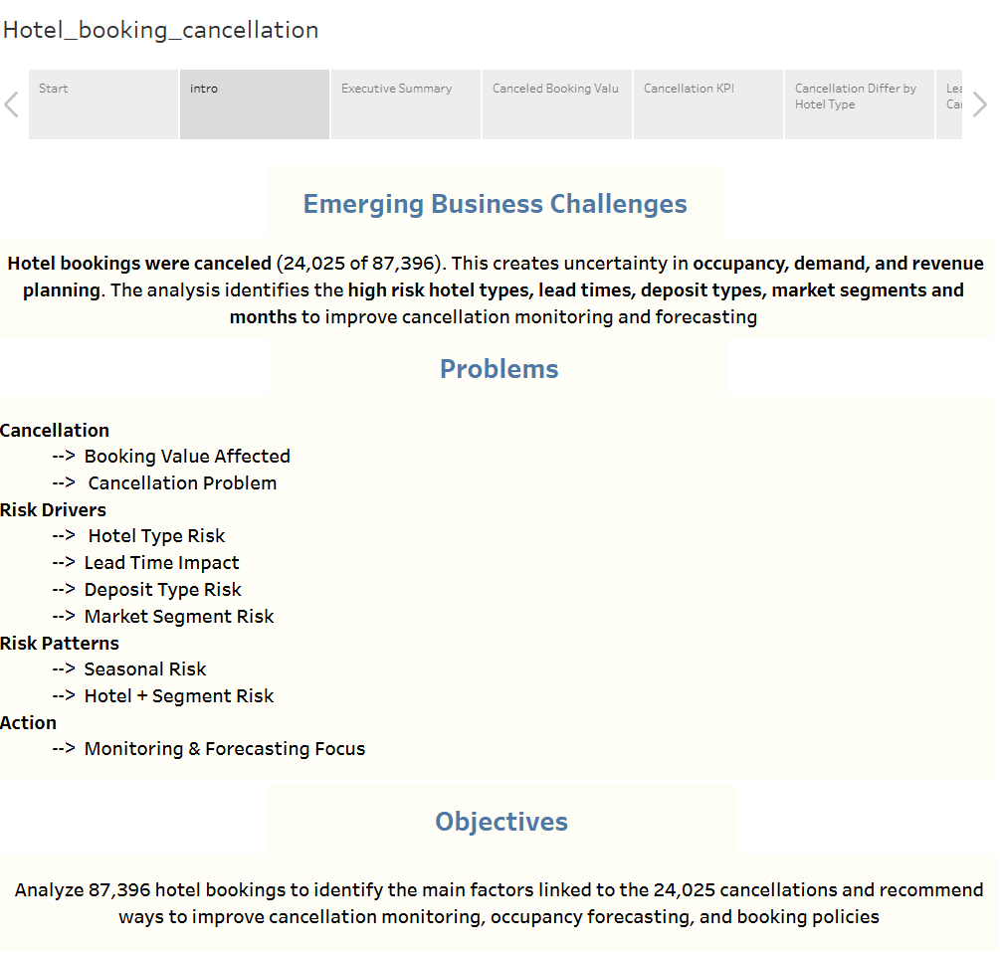
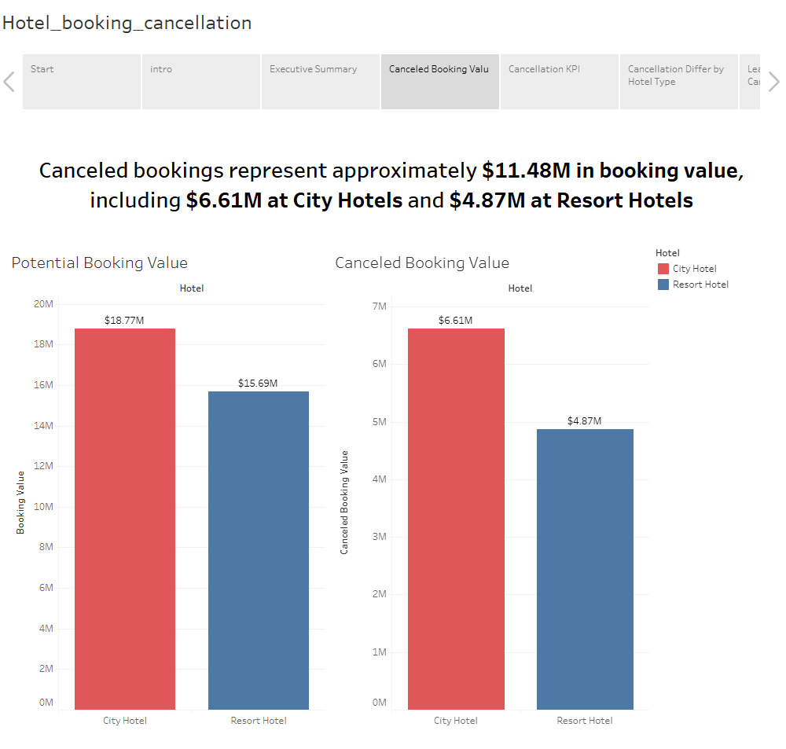
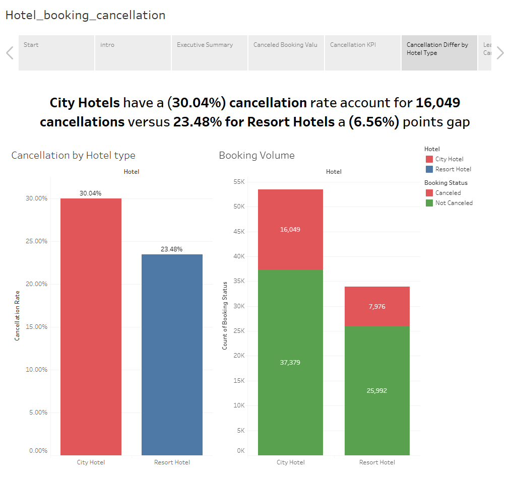
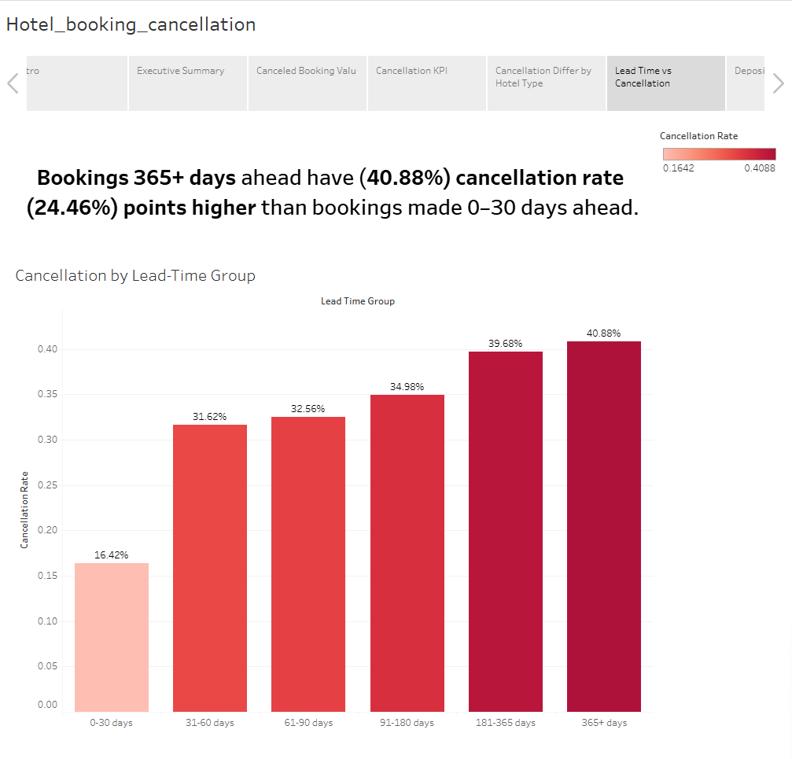
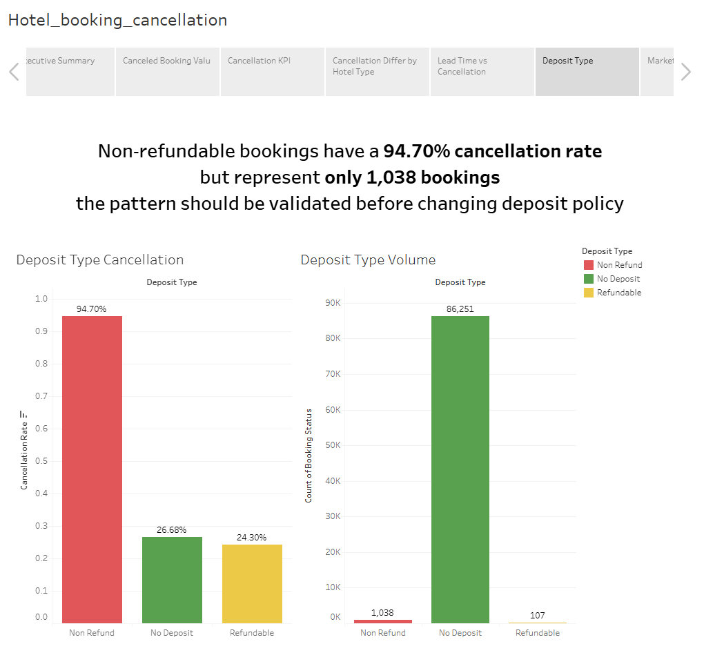
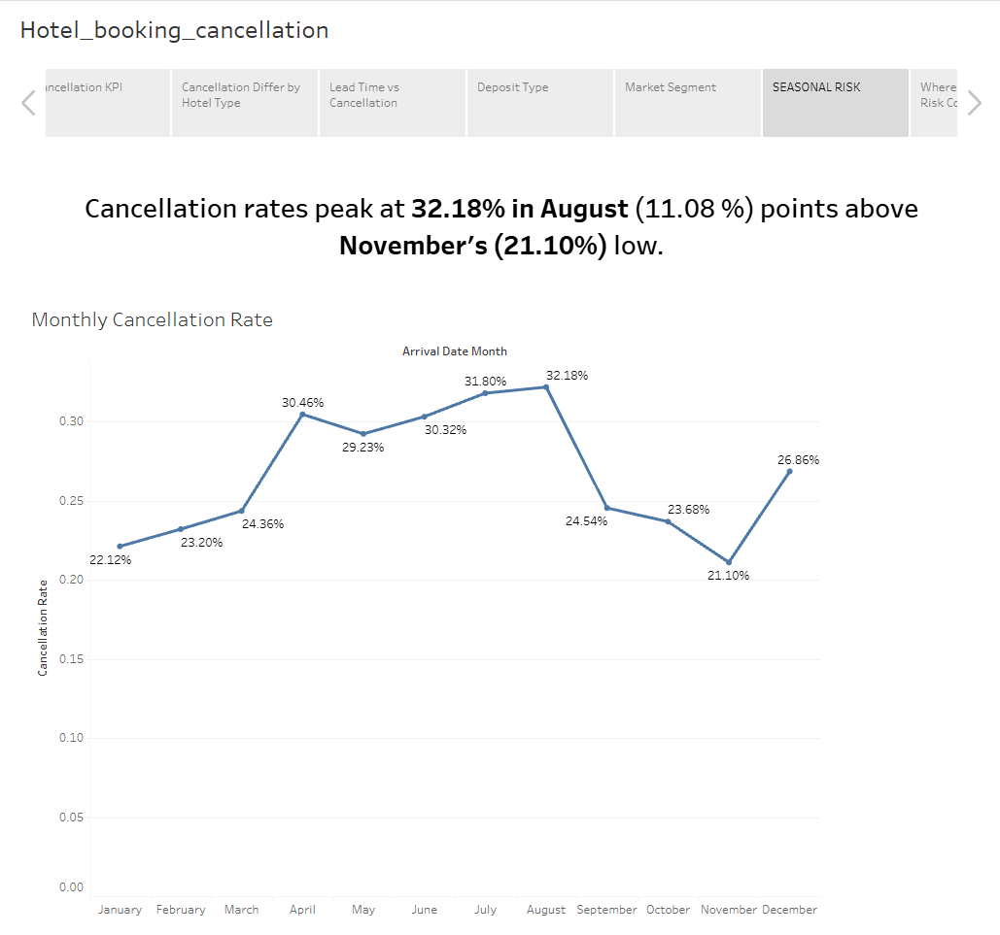
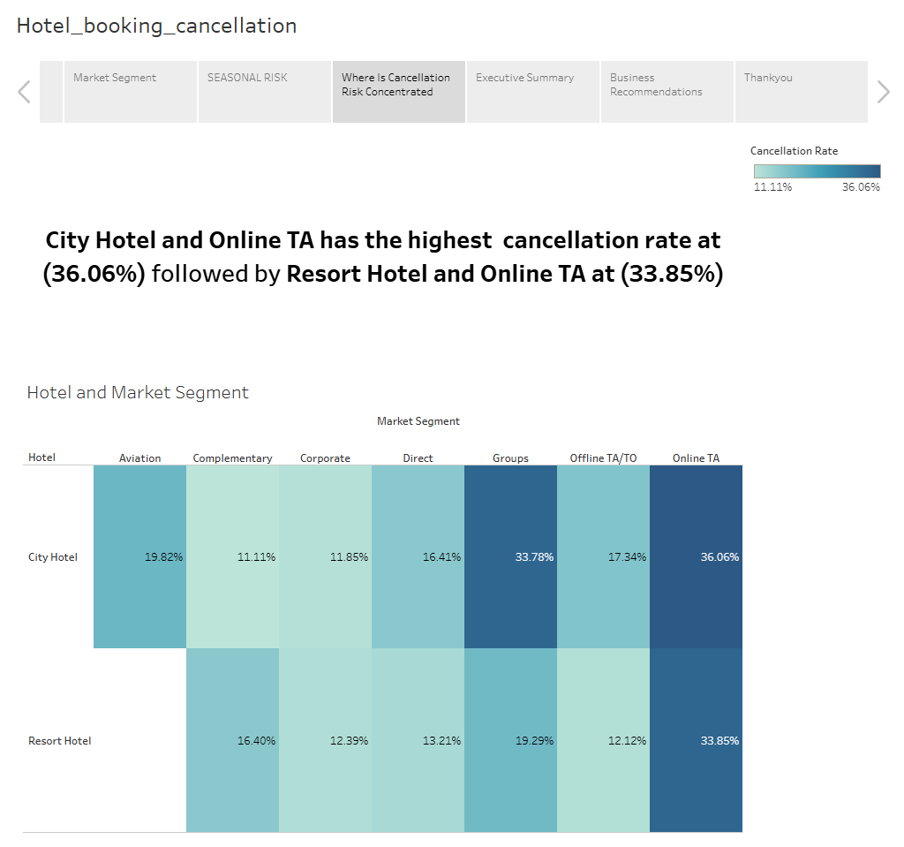

# 🏨 Hotel Booking Cancellation Analysis
> A business-focused analysis of 87,396 hotel bookings to identify cancellation patterns, revenue exposure, and key risk drivers affecting occupancy and demand forecasting.
> 
> ## 📊 Project Overview

This project analyzes 87,396 hotel bookings to understand the factors associated with 24,025 booking cancellations.

The analysis focuses on identifying cancellation patterns across hotel type, lead time, deposit type, market segment, and arrival month to support better occupancy forecasting, revenue planning, and cancellation monitoring.

The project was developed as a business-focused Tableau case study, translating booking data into actionable insights and recommendations for hotel management.

## 🎯 Business Problem

Hotel cancellations create uncertainty in occupancy, demand, and revenue planning.

The business needed to understand:

- How significant is the cancellation problem?
- Which hotel type has the highest cancellation risk?
- Does cancellation risk increase with longer booking lead times?
- Which deposit types are associated with higher cancellation rates?
- Which market segments contribute the greatest cancellation risk?
- Does cancellation risk vary by arrival month?
- How much potential booking value is associated with canceled reservations?

## 🎯 Business Objective

Analyze hotel booking data to identify the primary drivers of cancellations and recommend practical strategies to improve cancellation monitoring, occupancy forecasting, and booking policies.

## 📈 Key Findings

### 1. Cancellations Represent Significant Booking Value

A total of **24,025 bookings were canceled**, representing approximately **$11.48M in potential booking value**.

- City Hotels: **$6.61M**
- Resort Hotels: **$4.87M**

This highlights the financial impact of cancellations and the importance of improving cancellation monitoring and demand forecasting.

### 2. City Hotels Have Higher Cancellation Risk

City Hotels recorded a **30.04% cancellation rate**, compared with **23.48% for Resort Hotels**.

This represents a **6.56 percentage-point gap**, with City Hotels accounting for **16,049 cancellations**.

**Business implication:** City Hotels should receive greater attention when developing cancellation monitoring and occupancy protection strategies.

### 3. Longer Lead Times Are Associated With Higher Cancellation Risk

Cancellation rates increase substantially as the booking lead time increases:

| Lead Time | Cancellation Rate |
|---|---:|
| 0–30 days | 16.42% |
| 31–60 days | 31.62% |
| 61–90 days | 32.56% |
| 91–180 days | 34.98% |
| 181–365 days | 39.68% |
| 365+ days | **40.88%** |

Bookings made **365+ days in advance have a 24.46 percentage-point higher cancellation rate** than bookings made 0–30 days ahead.

**Business implication:** Long lead bookings should be monitored more closely and considered for proactive confirmation or retention strategies.

### 4. Non-Refundable Bookings Show an Unusual Cancellation Pattern

Non-refundable bookings have a **94.70% cancellation rate**, but represent only **1,038 bookings**.

Because of the relatively small booking volume, this pattern should be **validated before making changes to deposit policies**.

### 5. Cancellation Risk Is Seasonal

Cancellation rates vary considerably by arrival month.

- **August:** 32.18%  highest
- **July:** 31.80%
- **April:** 30.46%
- **November:** 21.10%  lowest

August's cancellation rate is **11.08 percentage points higher than November's**.

**Business implication:** Hotels should increase cancellation monitoring and demand forecasting efforts during higher risk summer months.

### 6. Online TA Creates a Significant Cancellation Risk

The highest cancellation rate occurs for the combination of **City Hotel + Online TA at 36.06%**, followed by **Resort Hotel + Online TA at 33.85%**.

This indicates that Online Travel Agency bookings represent an important segment for cancellation-risk monitoring.

**Business implication:** Hotels could evaluate targeted confirmation, communication, and booking-policy strategies for higher-risk OTA reservations.

## 💡 Business Recommendations

### 1. Prioritize City Hotel Cancellation Monitoring
Focus cancellation monitoring and occupancy protection efforts on City Hotels due to their higher cancellation rate and larger number of canceled bookings.

### 2. Monitor Long-Lead Bookings
Flag bookings made more than **180 days in advance**, with particular attention to bookings exceeding 365 days, where cancellation risk reaches 40.88%.

### 3. Strengthen Online TA Monitoring
Prioritize Online TA reservations for proactive confirmation and cancellation risk monitoring, particularly within City Hotels.

### 4. Increase Seasonal Monitoring
Increase forecasting and cancellation monitoring during **July and August**, when cancellation rates are among the highest.

### 5. Validate Non-Refundable Booking Patterns
Investigate the unusually high cancellation rate for non-refundable bookings before changing deposit or cancellation policies, given the relatively small sample size.

### 6. Protect At-Risk Booking Value
Use cancellation-risk indicators to prioritize reservations representing higher potential booking value and improve occupancy planning.

## 📷 Dashboard Preview

### 1. Emerging Business Challenges

### 2. Canceled Booking Value

### 3. Cancellation by Hotel Type

### 4. Lead Time vs Cancellation

### 5. Deposit Type Cancellation

### 6. Seasonal Cancellation Risk

### 7. Market Segment Risk

